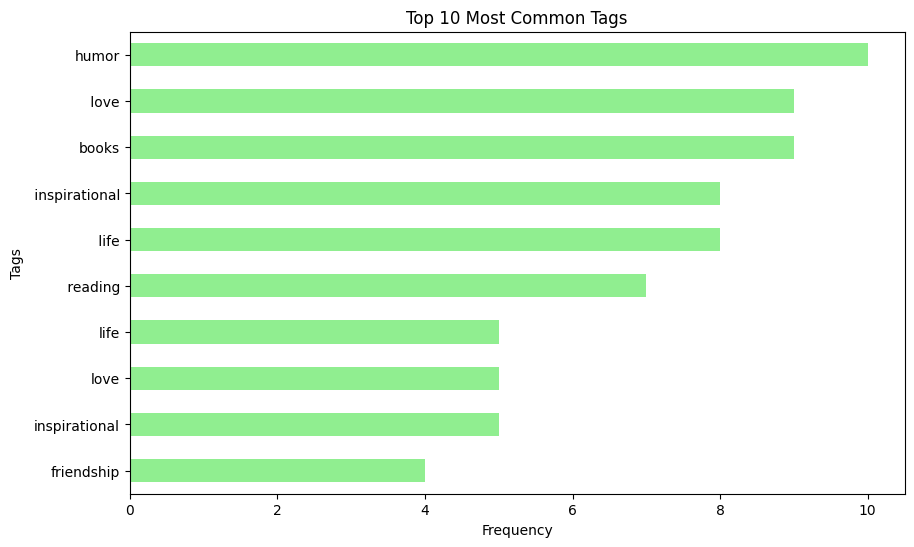
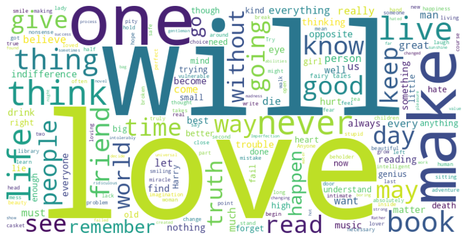

# 📜 Quotes Web Scraping and Exploratory Data Analysis (EDA)

## ❓ Guiding Questions

Before starting the analysis, this project was driven by a few key questions:

1. **What are the most common tags associated with quotes?**  
   → _Explored using a horizontal bar plot showing the Top 10 Most Common Tags._

2. **What is the typical length of quotes, and how does it vary across the dataset?**  
   → _Visualized using a Seaborn histogram that shows the distribution of quote lengths._

3. **Which words appear most often across all quotes?**  
   → _Represented through a Word Cloud revealing common themes and ideas._

These questions guided the entire data journey — from scraping raw text to generating insights through visualization.

---

## 🧠 Project Overview

This project demonstrates how to **scrape data from a website** and perform **Exploratory Data Analysis (EDA)** to uncover insights from textual information.  
The dataset is extracted from [quotes.toscrape.com](http://quotes.toscrape.com/), which contains famous quotes and their authors.

The goal was to explore:

- How to automate data extraction from a web source
- Clean and structure the data for analysis
- Visualize trends and insights effectively

Through this project, I covered the complete pipeline — **data extraction → cleaning → analysis → visualization.**

---

## 🧰 Technologies Used

- **Python** – Core programming language for data science and web scraping
- **BeautifulSoup** – Advanced HTML/XML parser for extracting data from web pages
- **Requests** – HTTP library for making web requests and handling responses
- **Pandas** – Powerful data manipulation and analysis library for structured data
- **Matplotlib & Seaborn** – Comprehensive visualization libraries for creating statistical plots
- **WordCloud** – Specialized library for generating visually appealing word cloud visualizations

---

## 📊 Project Workflow

### 1. 🕸️ Web Scraping

- **Multi-page Navigation:** Systematically accessed multiple pages of [quotes.toscrape.com](http://quotes.toscrape.com/) to ensure comprehensive data collection.
- **Data Extraction:** Extracted **quotes**, **authors**, and **tags** using BeautifulSoup's powerful HTML parsing capabilities.
- **Data Storage:** Stored all extracted data in a structured pandas DataFrame for efficient analysis and manipulation.

### 2. 🧹 Data Cleaning

- **Duplicate Removal:** Identified and removed duplicate entries to ensure data quality and accuracy.
- **Text Preprocessing:** Trimmed unnecessary characters, whitespace, and standardized text formats.
- **Data Validation:** Performed comprehensive checks for missing data and data integrity issues.

### 3. 🔍 Exploratory Data Analysis (EDA)

- **Top 10 Most Common Tags:**  
  Created a horizontal bar plot to show the most frequently used tags across all quotes.
- **Quote Length Distribution:**  
  Used Seaborn’s `histplot` to visualize how quote lengths vary.
- **Word Cloud:**  
  Generated a word cloud to highlight the most frequently used words in quotes.

---

## 📈 Key Insights

- **Tag Popularity:** _Love_, _inspirational_, and _life_ emerge as the most frequently used tags, indicating the dominant themes that resonate with readers seeking wisdom and motivation.
- **Quote Length Patterns:** Most quotes are **moderately sized** (typically 50-150 characters), suggesting an optimal balance between brevity and meaningful depth that resonates with readers.
- **Thematic Analysis:** Frequent words include _life, truth, love,_ and _wisdom_, reflecting universal motivational themes that transcend cultural and temporal boundaries.

---

## 🖼️ Visualizations

| Visualization                                                    | Description                                                   |
| ---------------------------------------------------------------- | ------------------------------------------------------------- |
|                    | Horizontal bar plot showing the Top 10 most common tags       |
|  | Histogram showing distribution of quote lengths               |
|                               | Word cloud highlighting the most frequent words across quotes |

---

## 📂 Project Structure

```
📁 WebScrappingWithEDA/
│
├── 📄 WebScrappingWithEDA.ipynb    # Main Jupyter notebook containing all scraping and EDA code
│
├── 📂 ExtractedData/               # Directory containing scraped data
│   └── quotes.csv                  # CSV file with all scraped quotes, authors, and tags
│
├── 📂 images/                      # Directory containing all generated visualizations
│   ├── quoteLengthDistribution.png # Histogram of quote length patterns
│   ├── top10MostCommonTags.png     # Bar chart of most common tags
│   └── wordcloud.png               # Word cloud of frequent terms
│
├── 📄 requirements.txt             # Python dependencies and package versions
│
└── 📄 README.md                    # Comprehensive project documentation
```

---

## ⚙️ Setup Instructions

### Prerequisites

- Python 3.7+ installed on your system
- Jupyter Notebook or JupyterLab or GoogleColab
- Internet connection for web scraping

### Installation Steps

```bash
# Clone this repository
git clone https://github.com/yourusername/WebScrappingWithEDA.git

# Navigate to the project folder
cd WebScrappingWithEDA

# Create a virtual environment (recommended)
python -m venv venv
source venv/bin/activate  # On Windows: venv\Scripts\activate

# Install required dependencies
pip install -r requirements.txt

# Launch Jupyter Notebook
jupyter notebook WebScrappingWithEDA.ipynb
```

### Alternative Setup

```bash
# Using conda environment
conda create -n webscraping python=3.9
conda activate webscraping
pip install -r requirements.txt
```

## 🎯 Learning Outcomes

- **Web Scraping Mastery:** Gained practical experience in web scraping using BeautifulSoup to extract structured data from HTML pages.

- **Data Analysis Skills:** Strengthened data cleaning and visualization skills using pandas, Seaborn, and Matplotlib for comprehensive data exploration.

- **Question-Driven Analysis:** Learned to explore data with a question-driven approach, similar to real-world analytical workflows and business intelligence practices.

- **Data Storytelling:** Developed storytelling ability through data visualization and insights, transforming raw data into meaningful narratives.

---

## 🔮 Future Work

- **Sentiment Analysis:** Perform sentiment analysis on quotes to classify them as positive, neutral, or negative using natural language processing techniques.

- **Interactive Dashboards:** Create interactive dashboards using Plotly or Streamlit for better visualization and user engagement.

- **Dataset Expansion:** Extend scraping to include more pages or different websites for a larger, more comprehensive dataset.

---

## 📖 Credits

**Course Information:**  
This project is part of the **Data Analytics (by NationSkillUp)** course, hosted on [GeeksforGeeks](https://www.geeksforgeeks.org/nation-skill-up/).

**Acknowledgments:**

- All credit for the course content, methodology, and educational structure goes to the respective instructor and GeeksforGeeks platform.
- Special thanks to the course instructor for providing comprehensive guidance on web scraping and data analysis techniques.
- This repository was created purely for **learning and educational purposes** as part of my data science journey.

**Educational Purpose:**  
This project serves as a practical implementation of concepts learned during the course, demonstrating real-world application of web scraping, data cleaning, and exploratory data analysis techniques.
